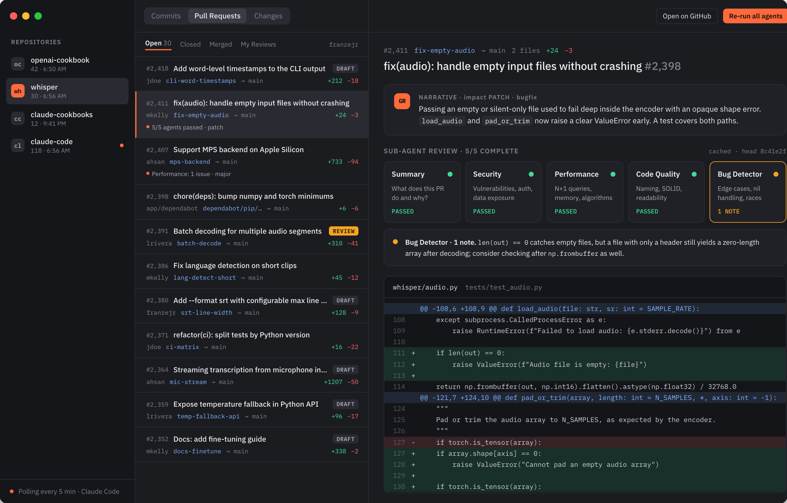

# GitRanger

**AI-powered git history narration and code review.**

A native macOS app that turns commits, diffs, and pull requests into plain-English narratives. Stop scrolling through cryptic commit messages — GitRanger summarizes changes, reviews PRs with parallel AI agents, and monitors your projects in real time.



---

## Why GitRanger?

- **Onboard faster** — Import any repo and instantly understand what happened, when, and why.
- **Review PRs with AI** — Get thorough, multi-perspective code reviews without leaving your desktop.
- **Stay in the loop** — Background polling and native notifications let you know the moment new commits land.
- **Your AI, your choice** — Use Claude Code, Codex CLI, Anthropic API, OpenAI, or fully local Ollama.

---

## Core Features

### AI-Powered Commit Summaries

Every commit gets a one-liner, a contextual explanation, an impact level (patch / minor / major / breaking), and category tags (bugfix, feature, refactor, docs, test, chore). Select multiple commits and generate a cohesive narrative that tells the story of your changes across time.

### Pull Request Code Reviews

Fetch open, closed, merged, or pending-review PRs directly from GitHub. Run a single-pass AI review with one click, then optionally run a **second validation pass** that re-examines the diff to confirm or challenge the first review's findings.

### Parallel Sub-Agent Reviews

This is where GitRanger really shines. Instead of a single reviewer, launch **five specialized AI agents in parallel** — each one focused on a different dimension of code quality:

| Agent | Focus |
|-------|-------|
| **Summary** | What does this PR do and why? |
| **Security** | Vulnerabilities, authentication, data exposure |
| **Performance** | N+1 queries, memory leaks, algorithm efficiency |
| **Code Quality** | Naming, SOLID principles, readability |
| **Bug Detector** | Edge cases, nil handling, race conditions |

All five run concurrently, so you get a multi-perspective review in the time it takes for one. Each agent reports a verdict — **Passed** or **Issues Found** — with a detailed explanation you can expand inline.

**Fully customizable per repository:**

- **Toggle agents on/off** — Only care about security and performance? Disable the rest.
- **Write custom prompts per agent** — Every agent ships with a sensible default prompt, but you can replace it with your own. Tell the Security agent to focus on OWASP Top 10, or tell the Code Quality agent to enforce your team's naming conventions.
- **Global review instructions** — Set a baseline prompt that applies to single-pass reviews across all repos.
- **Per-repo review instructions** — Override the global prompt for specific repos that need different context (e.g., "This is a Rails monolith, watch for N+1 queries in ActiveRecord").

You can re-run individual agents or all of them at once. Reviews are cached by PR + head SHA, so unchanged PRs don't cost extra.

### Working Tree & Commits

Stage, unstage, and discard changes with a visual file list. View inline diffs for any modified file. Write commit messages manually or let AI generate them from your staged changes — summary and description, ready to go.

### Multi-Commit Narratives

Select 2–20 commits and get a concise summary with bullet points of key changes. Optionally generate a Mermaid flowchart diagram showing the progression of changes. Great for changelogs, sprint recaps, or onboarding a teammate.

### Background Monitoring

GitRanger polls your repositories on a configurable interval (1 min to 1 hour) and sends native macOS notifications when new commits arrive. A menu bar icon keeps you informed at a glance.

---

## AI Providers

GitRanger is provider-agnostic. Pick the one that fits your workflow:

| Provider | Key Required | Local | Repo Context |
|----------|:---:|:---:|:---:|
| **Claude Code** (recommended) | No | No | Yes |
| **Codex CLI** | No | No | Yes (read-only) |
| **Anthropic API** | Yes | No | No |
| **OpenAI** | Yes | No | No |
| **Ollama** | No | Yes | No |

Claude Code and Codex CLI can reuse your existing CLI login and inspect the repository for richer context without a separate API key.

---

## Quick Start

**Requirements:**
- macOS 14 (Sonoma) or later
- Xcode 15+ or Swift 5.9+ toolchain
- Git installed
- Claude Code CLI, Codex CLI, or API keys for cloud providers
- GitHub CLI for PR reviews (optional): `brew install gh && gh auth login`

```bash
# Clone and build
git clone https://github.com/franzejr/GitRanger.git
cd GitRanger

swift build
swift run

# Or build a release binary
swift build -c release
.build/release/GitRanger
```

### Setting Up Claude Code (Recommended)

```bash
npm install -g @anthropic-ai/claude-code
claude login
```

### Setting Up Codex CLI

GitRanger reuses your existing Codex login and runs reviews through `codex exec`
with an ephemeral session and a read-only sandbox.

```bash
npm install -g @openai/codex
codex login
```

Select **Codex CLI** under **Settings > AI Provider**. Leave the model field
empty to use the CLI default, or enter any model available to your Codex account.

### Setting Up Ollama (Fully Local, No Internet)

```bash
brew install ollama
ollama pull llama3.2
ollama serve
```

For Anthropic API or OpenAI, add your API key in **Settings > AI Provider** inside the app.

---

## PR Reviews Setup

1. Install GitHub CLI: `brew install gh`
2. Authenticate: `gh auth login`
3. Import a GitHub repo in the app
4. Switch to the **Pull Requests** tab

**Per-repo settings** (right-click a repo > Settings):
- Choose which `gh` account to use (multi-account support)
- Write custom review instructions
- Configure sub-agent prompts and toggle individual agents

---

## App at a Glance

- **3-column layout** — Sidebar (repos), list (commits/PRs/changes), detail (diffs/reviews)
- **Branch switching** — Browse any branch with full commit history
- **Filters** — By author, date range, or branch
- **Paginated loading** — Scroll through thousands of commits smoothly
- **GitHub-style diffs** — Color-coded additions/deletions with syntax highlighting
- **Review caching** — Reviews are cached by PR + head SHA so you never pay twice
- **Dark mode** — Full light and dark mode support
- **SwiftData persistence** — All repos, commits, and reviews persist across sessions
- **Menu bar icon** — Quick status and manual sync from the menu bar

---

## Project Structure

```
├── Package.swift
├── Sources/
│   └── GitRanger/
│       ├── App/            # Entry point, menu bar, settings
│       ├── Models/         # SwiftData models (Repo, Commit, PRReview, SubAgentReview)
│       ├── Resources/      # App icon, menu bar icon
│       ├── Services/       # Git, GitHub, AI providers, polling
│       ├── ViewModels/     # @Observable view models (MVVM)
│       └── Views/          # SwiftUI views (sidebar, lists, detail, changes)
├── Tests/
└── assets/                 # Logo and branding images
```

## CI/CD

| Workflow | Trigger | What it does |
|----------|---------|-------------|
| **Build & Lint** | Push/PR to main | `swift build`, `swift test`, SwiftLint |
| **Dependency Check** | Package.swift changes + weekly | Resolves and validates the Swift package graph |
| **Release** | Tag `v*` | Builds .app bundle, creates GitHub Release |

## Documentation

See [docs/architecture-v4.md](./docs/architecture-v4.md) for the full system design and technical details.

## Contributing

We welcome contributions! See [CONTRIBUTING.md](./CONTRIBUTING.md) for guidelines.

## License

MIT License — see [LICENSE](./LICENSE) for details.
